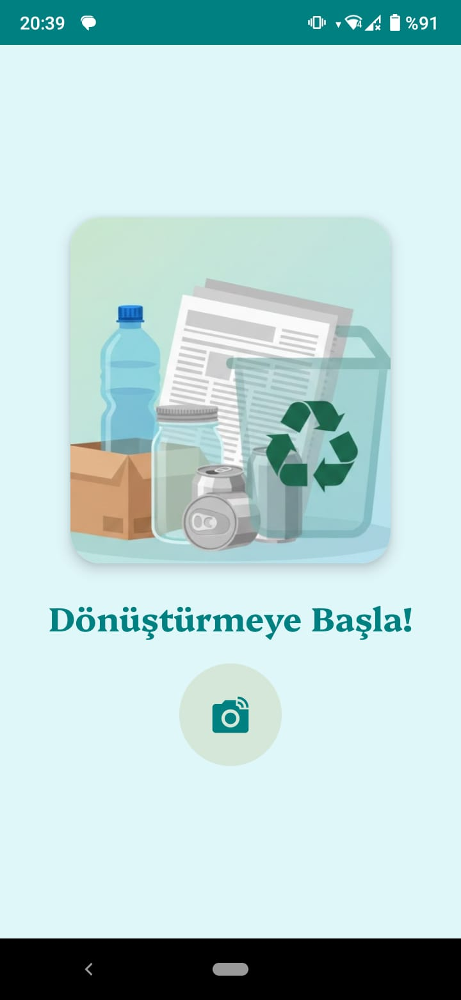
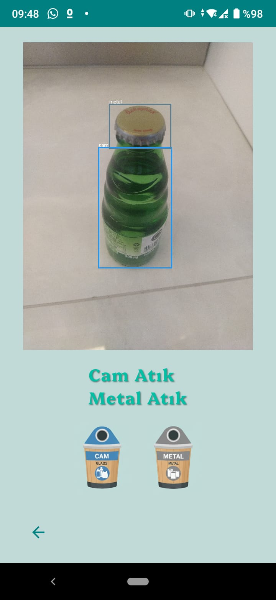
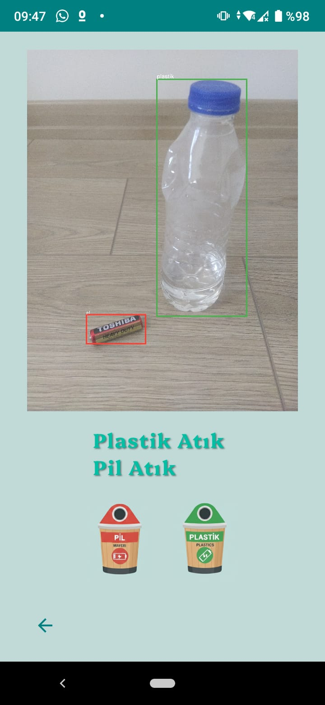
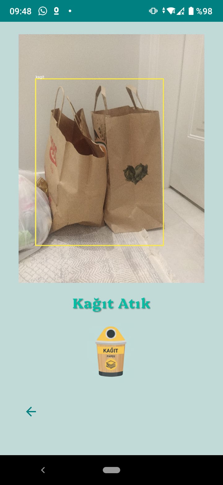

# Waste Classification App (Recycle Now / Hangi Atık?)


An intelligent Android application that identifies and classifies household waste into five major categories using **Computer Vision** and **Deep Learning**. Developed as a project for the Image Processing course, this app aims to promote recycling by helping users sort their waste correctly.

## Features

- **Real-time Detection:** Capture images directly via the camera for instant analysis using the CameraX API.
- **Gallery Support:** Import and analyze existing photos from the device gallery.
- **Deep Learning Integration:** Powered by an optimized **YOLO-based** (You Only Look Once) TensorFlow Lite model for high-speed inference.
- **Smart Result Visualization:** Features a dedicated results screen with a "glow" animation that highlights the detected waste category.
- **Supported Categories:**
  - **Battery (Pil)**
  - **Paper (Kağıt)**
  - **Plastic (Plastik)**
  - **Glass (Cam)**
  - **Metal (Metal)**
 
## Screenshots


<p float="left">
  
  
  
  
</p>|


## Tech Stack & Architecture

- **Language:** [Kotlin](https://kotlinlang.org/) - Modern Android development.
- **Model Framework:** [TensorFlow Lite](https://www.tensorflow.org/lite) - On-device AI inference.
- **Core Algorithm:** **YOLO** - Real-time object detection architecture.
- **Camera API:** [CameraX](https://developer.android.com/training/camerax) - Lifecycle-aware camera management.
- **Image Processing:**
    - **YUV to RGB Conversion:** Uses a custom `YuvToRgbConverter` to transform raw camera sensor data into processed Bitmaps.
    - **Bitmap Optimization:** Handles image rotation, scaling, and EXIF orientation fixes.
- **UI Architecture:** View Binding, Fragment-based navigation, and custom View Animations for feedback.

## Key Components

| File | Role |
| :--- | :--- |
| **`CameraFragment.kt`** | Handles camera lifecycle, permission checks, and triggers the YOLO model. |
| **`YuvToRgbConverter.kt`** | A technical utility to convert `ImageProxy` (YUV) data to `Bitmap` (RGB). |
| **`ResultFragment.kt`** | Displays detection results and triggers animations for the corresponding waste type. |
| **`MainActivity.kt`** | Main entry point managing fragment transactions and base UI. |

## Installation

1. Clone the repository:
   ```bash
   git clone [https://github.com/eniseahsen/recycle_now_mobile_app.git](https://github.com/eniseahsen/recycle_now_mobile_app.git)
